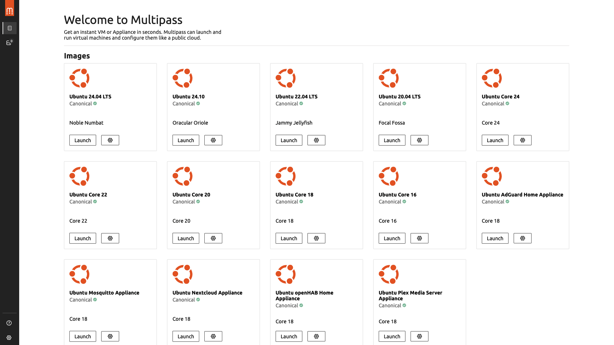
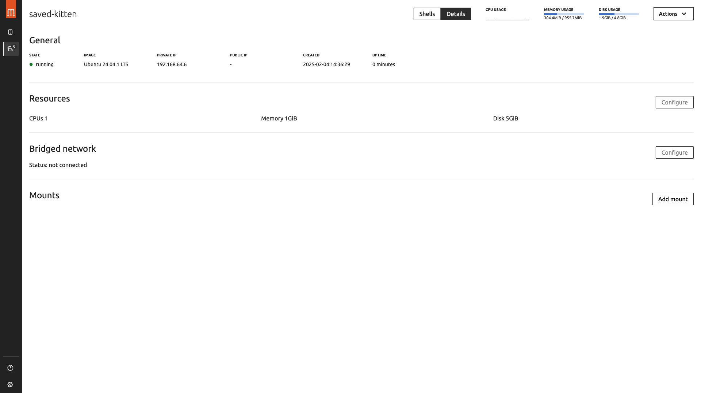
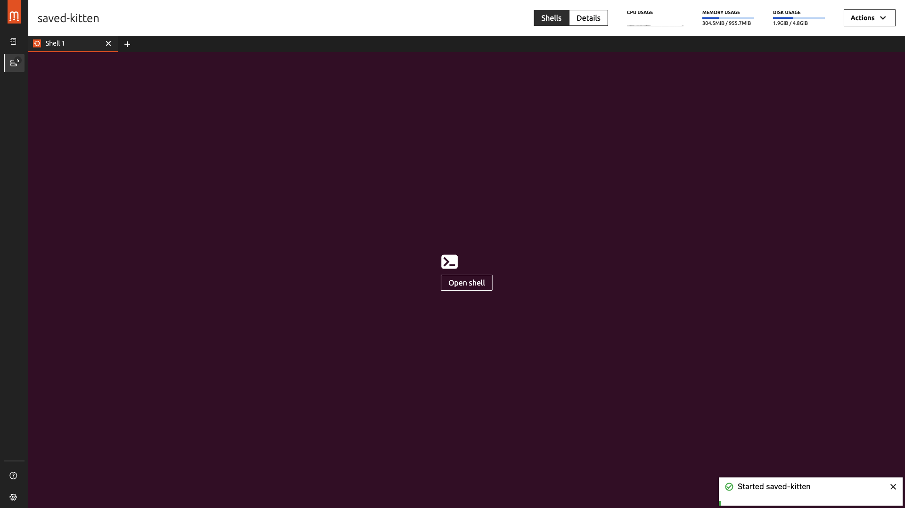
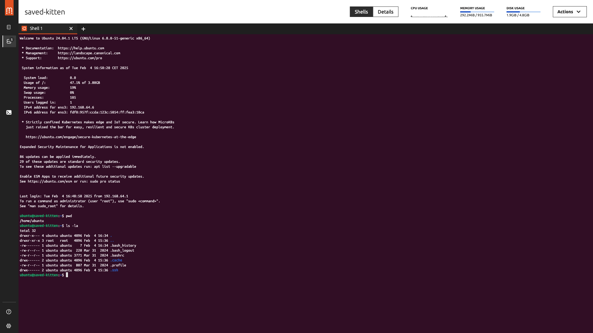
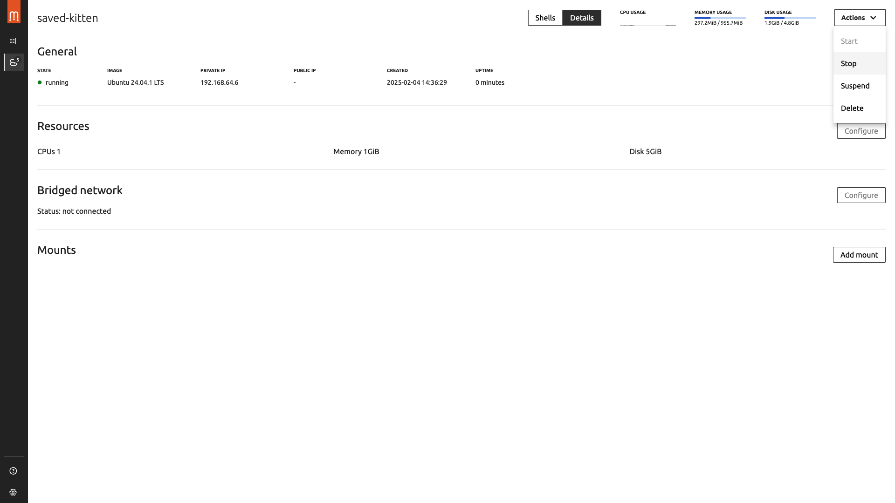

# Enabling Ubuntu VM using Multipass on MacOS 
MacOS is Linux based but if you need to setup quickly an ubuntu virtual machine, you can use Multipass. Multipass is a tool created by Canonical.


> Multipass is a tool to generate cloud-style Ubuntu VMs quickly on Linux, macOS and Windows. It provides a simple but powerful CLI that enables you to quickly access an Ubuntu command line or create your own local mini-cloud. 
>
> Local development and testing can be challenging, but Multipass simplifies these processes by automating setup and teardown. Multipass has a growing library of images that you can use to launch purpose-built VMs or custom VMs you’ve configured yourself through its powerful cloud-init interface.
>
> Developers can use Multipass to prototype cloud deployments and to create fresh, customized Linux dev environments on any machine. Multipass is the quickest way for Mac and Windows users to get an Ubuntu command line on their systems. You can also use it as a sandbox to try new things without affecting your host machine or requiring a dual boot.

## Step 1: Install Multipass 
Follow this [tutorial](https://canonical.com/multipass/docs/install-multipass): 
1. Download the latest installer and install it 
2. Open a terminal, check the version with this command:

```bash
multipass version
```
 
## Step 2: Create and lunch an Ubuntu VM with Multipass
There are 2 ways : from a terminal or from the Multipass application.
More details are available [here](https://canonical.com/multipass/docs/create-an-instance) and [there](https://canonical.com/multipass/docs/use-an-instance).

### A. From a terminal
1. Open a terminal
2. Launch a new instance (Multipass chooses a random name for your instance): 
```bash
multipass launch
```
> Lauched: saved-kitten

3. Get information on this instance:
```bash
multipass info saved-kitten
```
The information appears concerning the Ubuntu LTS release version, the RAM, the number of CPU, the disk memory.

4. Use the instance by opening a shell prompt inside the instance
```bash
multipass shell saved-kitten
```

5. Mount volumes from local host machine (source) to Ubuntu VM (target):
Before mounting any volumes, please check the permissions of the source local folder on your host machine:
```bash
ls -l {path_to_the_local_host_volume_to_mount}
```

Change permissions with `chmod 777 -R {path_to_the_local_host_volume_to_mount}` if you need to give all rights to read, write and execute to all users for all files in the volume to mount.

To mount volumes:
```bash
multipass mount {source_host_machine} {ubuntu_instance}
```

Example to mount `/home/user/src_dir` from host macOS machine to the `saved-kitten` ubuntu instance:
```bash
multipass mount /home/user/src_dir saved-kitten
```

6. Unmount volumes 
```bash
multipass unmount saved-kitten
```

7. Suspend a running instance
```bash
multipass suspend {name_of_the_instance}
```

8. Stop a running instance
A running, not suspended instance is stopped with the command:
```bash
multipass stop {name_of_the_instance}
```

9. Start a suspended/stopped instance:
```bash
multipass start {name_of_the_instance}
```

10. Check the status of instances
To list all the instances and their status:
```bash
multipass list  
```

### B. From the Multipass application
1. Go to the Applications, and click on "Multipass" application to launch it.

2. Launch a new instance from an Ubuntu image (Multipass chooses a random name for your instance): 


3. Get information on this instance by clicking on `Details` button:


The information appears concerning the Ubuntu LTS release version, the RAM, the number of CPU, the disk memory.


4. Click on `Shell` button to open a shell prompt:
. 
. 


5. Mount volumes from local host machine (source) to Ubuntu VM (target):
Before mounting any volumes, please check the permissions of the source local folder on your host machine (check previous section for commands).
From the `Details`interface, click on `Add mount` to specify the source and targer folders.

6. Unmount volumes by deleting the mounted volumes.


7. Start/Stop/Suspend/Delete an instance from the `Àctions` button:

8. Start a suspended/stopped instance:
. 

9. Check the status of instances from the left panel `Instances`.

